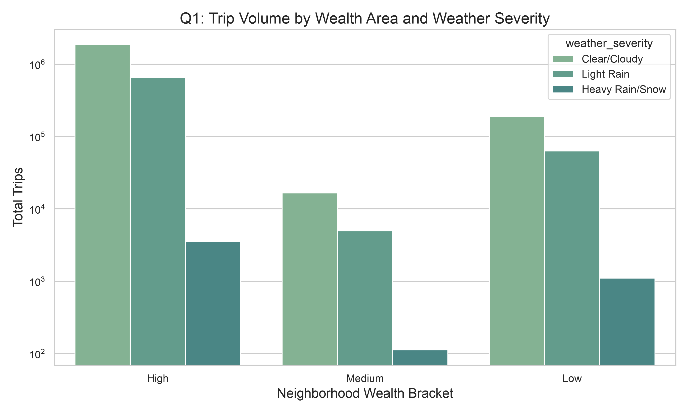
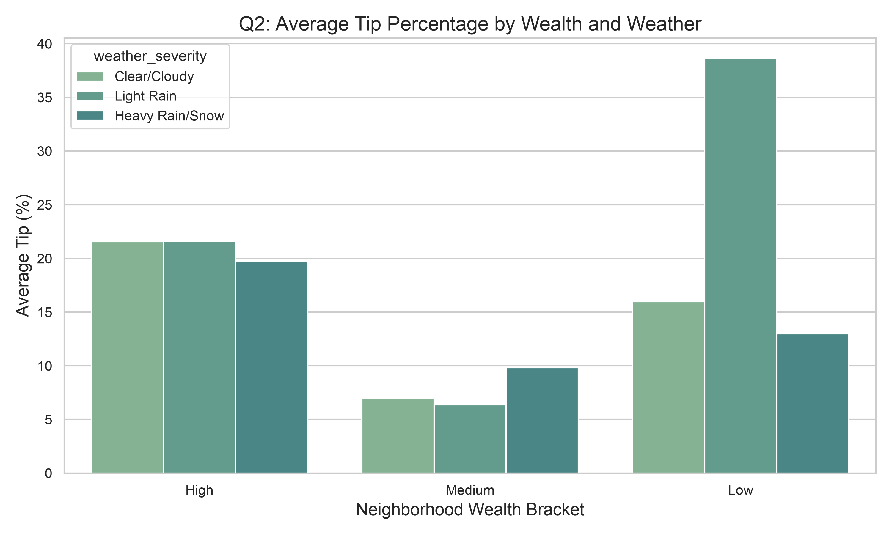
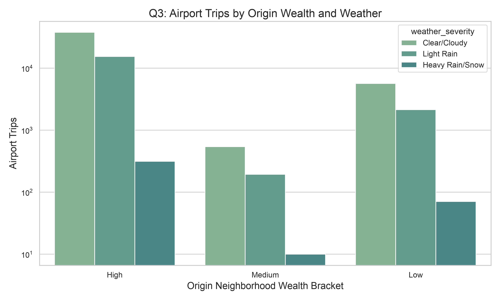
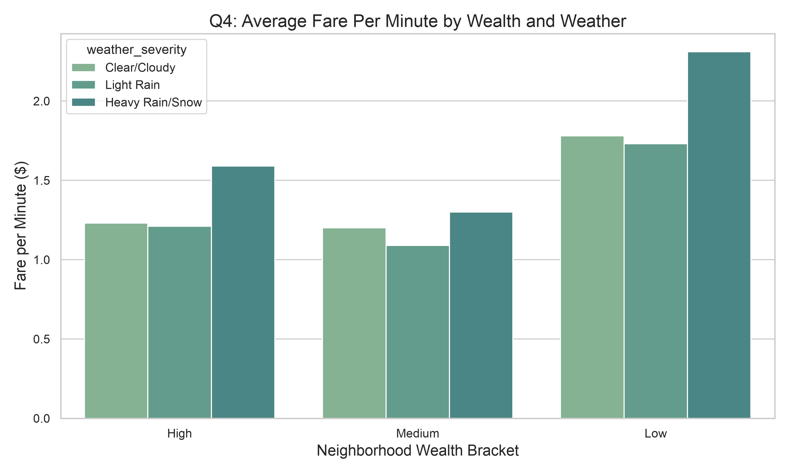
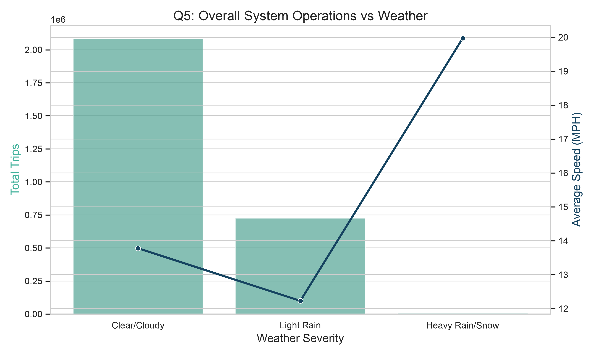

# NYC Taxi & Weather Big Data Pipeline
### Presentation
**Presented by:** Panithi Tawethipong

---

## 1. The Goal: A Socioeconomic Anchor
Most transit analyses stop at "how does weather affect trip volume?" **This project goes deeper.** I used **socioeconomic wealth tier as my primary anchor** to investigate how systemic resilience and human economic behavior shift under extreme weather.

**Key Technologies:**
- Apache Spark (PySpark)
- Terraform (IaC)
- AWS S3 (Data Lake)
- Amazon Athena (Serverless Analytics)

---

## 2. Architecture & Pipeline
- **Phase 1 (Local):** Aggregated 3 massive datasets (TLC Trips, NOAA Weather, NYC Property Taxes). Cleaned out extreme outliers and joined them into highly optimized Parquet partitions.
- **Phase 2 (Cloud):** Deployed a serverless infrastructure via Terraform. Uploaded processed data to an Amazon S3 Data Lake.
- **Phase 3 (Analytics):** Executed distributed, serverless SQL queries against S3 using Amazon Athena to extract macro-trends.

---

## 3. Finding 1: Volume vs. Wealth
*Do neighborhoods of different wealth brackets experience disproportionate drops in service?*

**Insight:** All areas suffer during heavy rain/snow. However, High Wealth areas maintain a baseline of ~3,500 trips, whereas Low Wealth areas drop to near zero.

---

## 4. Finding 2: Tipping Surges
*Does weather severity affect tipping percentages?*

**Insight:** Low Wealth areas experience a massive spike in tipping during Light Rain (jumping from 15% to 38%), whereas High Wealth areas remain steady at ~21%.

---

## 5. Finding 3: Property Type & Airport Travel
*Do neighborhoods dominated by large single-family homes show different travel patterns than dense condo/co-op areas?*

**Insight:** By correlating wealth tiers to property types, I found that high-value single-family townhouse/co-op areas generated 37,927 clear-weather airport trips compared to just 5,667 from high-density, low-wealth condo areas. Furthermore, high-density areas dropped at a much sharper rate during extreme weather.

---

## 6. Finding 4: The Pricing Squeeze

**Insight:** Low Wealth areas see the highest fare-per-minute cost during Heavy Rain ($2.31/min compared to $1.78/min on clear days).

---

## 7. Finding 5: Macro Operations

**Insight:** Heavy Rain crashes total trip volume (2.1M -> 4,700), but the empty roads cause average taxi speeds to jump from 13.7 MPH to nearly 20 MPH.

---

## 8. The Story: A Tale of Two Cities
When severe weather hits, the transit system essentially collapses (total trips plummet, speeds skyrocket). **But the burden is not shared equally.**

- **The Availability Evaporation:** Taxis congregate where the money is. Low-wealth neighborhoods are effectively abandoned.
- **The Desperation Premium:** Low-wealth passengers are penalized the most, facing the highest fare-per-minute surges.
- **The Incentive Tip:** Out of desperation, low-wealth passengers tip an incredible 38% just to incentivize drivers, while wealthy passengers hold steady at 21%.

---

## 9. Conclusion
- Successfully deployed a modern, end-to-end Big Data pipeline.
- Demonstrated advanced distributed computing techniques (PySpark, AWS Athena).
- **Final Takeaway:** While extreme weather disrupts the entire network, it acts as a luxury service that protects wealthy neighborhoods, forcing lower-income areas to endure near-zero availability, extreme pricing surges, and the burden of exorbitant tipping.
